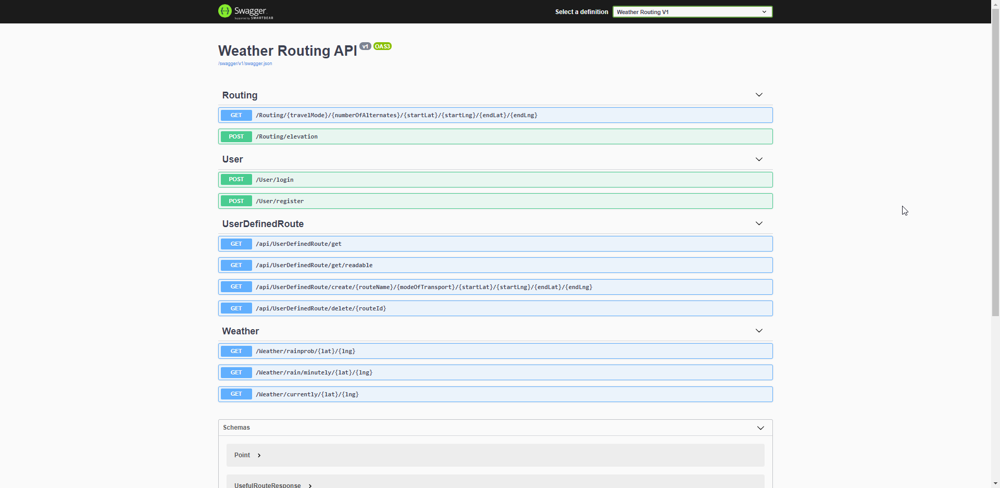

# WeatherRoutingBackend
The backend is a RESTful API .NET Core Project. I use this as the middleman between the frontend which is user facing, and the 3 data collecting APIs or the projects database.

## Swagger
I have set up swagger on this application. What this means is that there is a quick way for me to develop and test my calls, this stops the need for postman or other request sending software. It is also great for showing off a backend as it more visually shows what has been accomplished. IT also allows for documentation however I feel that I created self-descriptive code.
 

## Routing Controller
The routing controller is in charge of communicating with the TOMTOM api and getting routes for an inputted latitude and longitude. The second responsibility is to get the elevation of a route, this is done by passing a list of the latitude and longitude value of the route to the google elevation API, returning an evaluation value on each pair.

## User Controller
This controller controls the login and the register process. Both these methods are coded to catch errors and respond the correct error code depending on the error (e.g. bad request if username already exists for registering of an already used username, unauthorised for incorrect details).

The creation of the JWT token happens here, this stores the secret key in the appsettings.json file which is the best place for it. It could have been in the code or exponentially worse it could be present in the frontend code.

This is also where password hashing is done. In the database section it is explained why this is a much better process.

## UserDefinedRoute Controller
This controller deals with all the user defined routes (routes that have been favourited/unfavourited by the user). This is the only controller that requires authentication, as it is the only controller that deals with actions that require a user to be logged in. This authentication follows the JWT bearer scheme.

This controller holds the retrieval of all routes favourited by the user. Allows the creation of a route to the database (favouriting) and the deletion of a route (unfavouriting or deleting).

## Weather Controller
This controller controls the communication between the frontend and the weather information provider Dark Sky. There are two calls. One to retrieve the minutely data and the other to retrieve back the current weather information.

## Entity Framework
Entity framework is an object database mapper for .NET applications. This is in charge of the database connection and also the retrieval of objects from the database. To access the database, I use entity frameworks to call stored procedures. These stored procedures then have their results mapped to the objects defined in the Entity Framework. 

## Base controller Inheritance
There is inheritance present where most controllers inherit from base controller. This is done to remove duplicate get response code. It is also used so that only one HTTPClient object is created which is recommended.

## Appsettings.json (Holding of Secret Keys)
This holds the keys for the APIs I am contacting. It also holds the security key for the hash generation. These are not secure to an industry standard however is good enough for this project. What I could have used was Active Directory however I wanted to get marks for implementing my knowledge of database protection such as the hashing and salting of passwords. 
